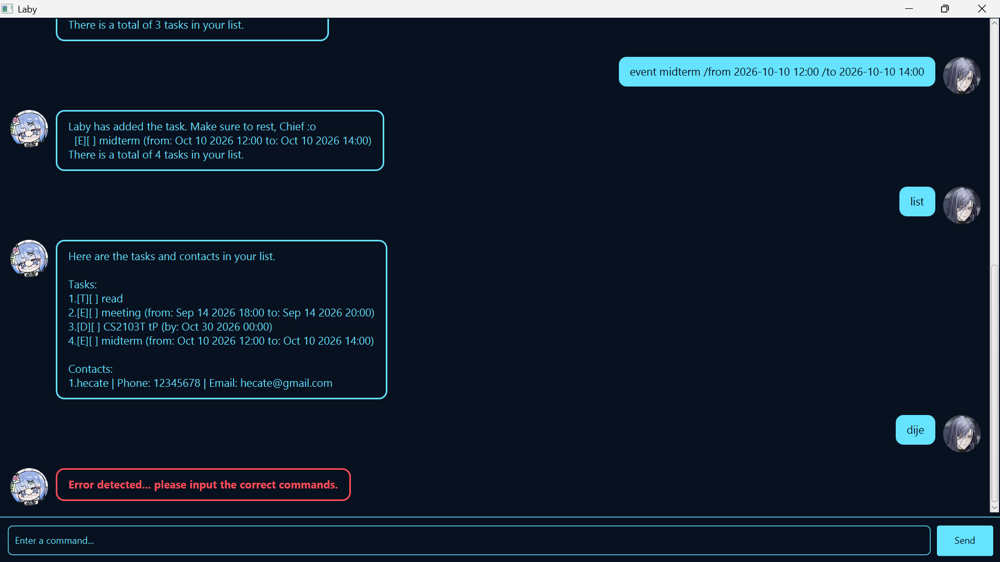

# Laby

Laby is a personal assistant that helps you manage tasks and contacts through a simple interface. You can create to-dos, deadlines, and events, keep track of completed tasks, search your task list, and store contact details.



*Image credit: Profile pictures are taken from in-game screenshots of [Path to Nowhere](http://ptn.aisnogames.com/en-EN/home).*

## Getting started

### Prerequisites

- Java 25

### Running the application

1. Download the provided `laby.jar` file from the [GitHub repository](https://github.com/bibikowlf/ip).
2. Open a terminal in the folder containing the downloaded JAR file.
3. Start Laby:

   ```powershell
   java -jar laby.jar
   ```

When the application opens, enter a command in the input box and press `Enter` or click `Send`.

## Features

- Add to-dos, deadlines, and events.
- Mark tasks as done or not done.
- List all tasks and contacts.
- Find tasks by keyword.
- Add and delete contacts.

## Command reference

| Command | Format | Purpose |
| --- | --- | --- |
| Add to-do | `todo <DESCRIPTION>` | Adds a task without a date or time. |
| Add deadline | `deadline <DESCRIPTION> /by <DATE_AND_TIME>` | Adds a task with a deadline. |
| Add event | `event <DESCRIPTION> /from <START_DATE_AND_TIME> /to <END_DATE_AND_TIME>` | Adds a task for a period of time. |
| List items | `list` | Displays all tasks and contacts. |
| Find tasks | `find <KEYWORD>` | Displays tasks containing the keyword. |
| Mark task | `mark <TASK_INDEX>` | Marks a task as done. |
| Unmark task | `unmark <TASK_INDEX>` | Marks a task as not done. |
| Delete task | `deletetask <TASK_INDEX>` | Deletes a task. |
| Add contact | `contact <NAME> /p <PHONE_NUMBER> /e <EMAIL_ADDRESS>` | Adds a contact. |
| Delete contact | `deletecontact <CONTACT_INDEX>` | Deletes a contact. |
| Exit | `bye` | Closes the application. |

For detailed explanations and examples, see the [Laby User Guide](docs/README.md).

Date and time values must use the `yyyy-MM-dd HH:mm` format. Replace angle-bracketed values with your own information and do not type the angle brackets.

## Data storage

Laby stores tasks and contacts in `data/laby.txt`. The file is created automatically when the application starts, so your data is available the next time you run Laby from the same project or application folder.

## Credit

This project is assisted by AI. ChatGPT Codex was used by the developer to generate and review code with human oversight. The use includes documentation and testing.